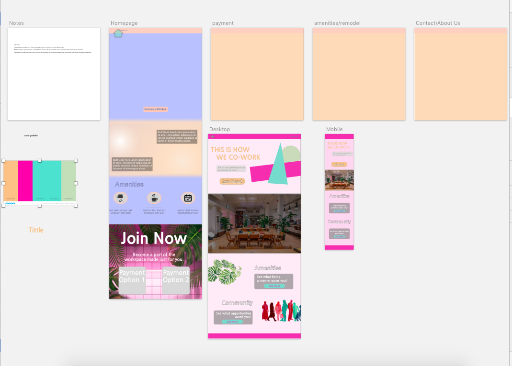
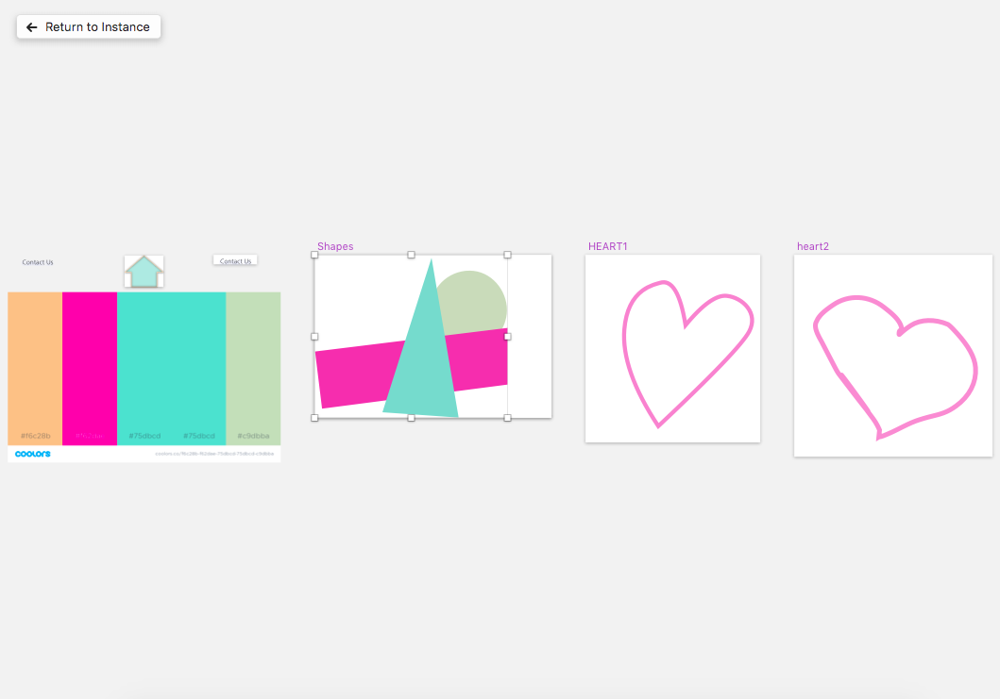

# _Free Lance Site_

#### _Free Lance Site 2/22/2019_

#### By _*Drew Yoxsimer*_

## Description

_This is a mockup of a website for a co-work space business. The website will include pages for the landing page, events, amenities, forum, membership, and contact._

## Setup/Installation Requirements

* _Make sure you have NODE installed on your computer._
* _After you have node installed, clone the repository from https://github.com/drewyox/FreeLanceProj ._
* _After than, run npm install in your terminal._
* _This should download and install all the dependencies as listed in the package.json file._

# _Images of Sketches_

# _Screen Shots of WireFrame_

## User Stories

* _New User, who is not affiliated with a tech company:_
* _Needs: Wants to learn as much as possible through a quick glance at the site. They're looking for space for their new project, and want to know if they'll be a good match personality wise as well._
* _Pain Points: Other spaces seemed to exclusively Tech-y, didn't have features (as far as the physical space goes) highlighted in their websites._
* _How Can We Serve?: Make the site clearly state information with intuitive navigation between them. Emphasize the funky yet approachable style through design._

* _Established User:_
* _Needs: Wants to stay updated with any new events or updates to the workspace. Wants to engage in workspace culture._
* _Pain Points: Doesn't want to be bogged down by continually being asked to join their site if they are already a member._
* _How Can We Serve?: Include a login so returning users can both avoid constant prompts for joining, and contribute to the site either through events._

## User Personas

* _As a small business owner, I would like to find a workspace that is tailored to my team and their fun personality._
* _As a small business owner who is in the workspace already, I would like a clear and reliable way to stay updated on the changes and features added to this workspace._
* _As an employee working in this workspace, I would like a fast, easy way to connect with others around me in a social sense.
* _As a potential workspace candidate, I would like a clear and ordered list of what amenities area availabe, whether it be the physical space itself or the services provided._

## Known Bugs

* _There are no known bugs._

## Responsiveness

* _The project has basic media queries that resize the text, stack objects that were oriented in rows, and hide certain images at just above standard Tablet (770px) and mobile device (550px) pixel sizes._

## Technologies Used

* _This project uses Node Project Manager to facilitate proper CSS HTML and dev server functionality_

## Developmental Roadmap

* _While there is a lot to continue on this project, I wish to refine my css skills more in order to get the responsiveness of the header image as I envisioned it, as well as the stylings for boxes. I also wish to include multiple pages with functioning links._

### License

*This Software is Licensed under the MIT License.*

Copyright (c) 2019 **_Drew Yoxsimer_**
